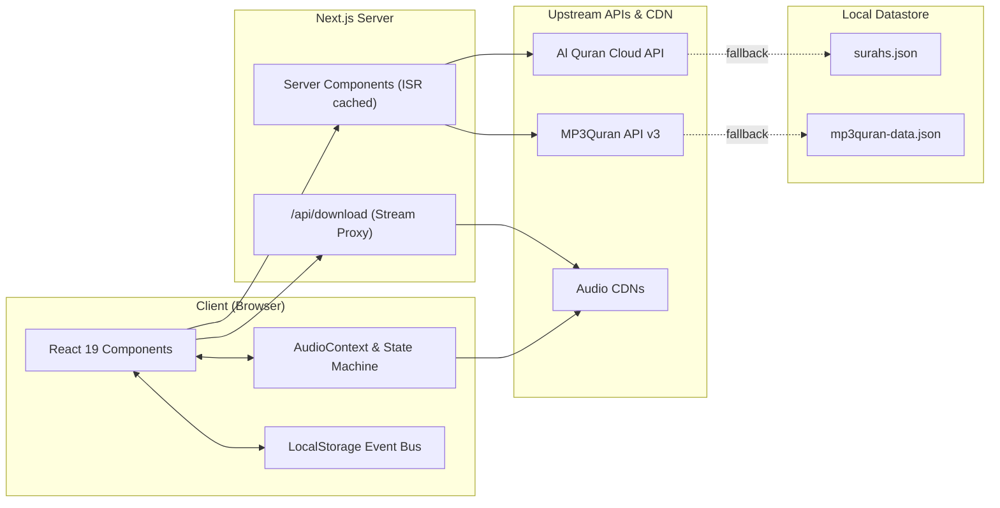

# Qiraya (قِراية)

A modern, distraction-free Holy Quran web app and PWA. Built with Next.js 16 (App Router), React 19, Tailwind CSS v4, and dual-source audio streaming.

[](https://nextjs.org/)
[](https://react.dev/)
[](https://www.typescriptlang.org/)
[](https://tailwindcss.com/)
[](https://next-intl.dev/)
[](LICENSE)

---

## Overview

Most web-based Quran platforms are cluttered with ads, have sluggish UIs, or break completely when upstream APIs go down.

**Qiraya** is built to solve that:
- Clean typography and zero advertisements.
- Resilient hybrid data pipeline: fetches live data with ISR caching, backed by local JSON datasets when offline or when external APIs fail.
- Dual audio engine: verse-by-verse recitation highlighting + direct full-surah MP3 streaming across multiple Riwayat (Hafs, Warsh, Qalun, Al-Duri, etc.).
- Local-first persistence: reading position and bookmarks sync instantly across tabs with no database overhead.

---

## Features

- **Interactive Reader**:
  - Continuous Mushaf flow (`۝` verse separators) or card-by-card breakdown with translation.
  - Automatic Basmalah stripping on verse 1 for non-Fatihah surahs (`sanitizeAyahText`).
  - Dynamic Arabic typography scaling (18px - 48px) with zero layout shift.
- **Audio Engine**:
  - 200+ reciters with curated profiles and verified portraits.
  - Race-condition safe: catches and swallows browser `AbortError` / play promise interruptions.
  - Background playback, queue management, looping, and variable speed.
- **Instant Search**:
  - Diacritic-agnostic Arabic search + English Sahih International query matching.
- **Offline & PWA**:
  - Installable on mobile & desktop via `manifest.json`.
- **Download Proxy**:
  - `/api/download` endpoint streams upstream MP3s with RFC 5987 UTF-8 `Content-Disposition` headers so Arabic file names save cleanly.
- **Bilingual (i18n)**:
  - Full Arabic (RTL) & English (LTR) support powered by `next-intl`.
- **Theming**:
  - Dark & light palettes defined in `oklch` with circular clip-path View Transitions.

---

## Tech Stack

| Layer | Technology | Why |
| :--- | :--- | :--- |
| **Framework** | Next.js 16.3.4 (App Router) | React Server Components, Turbopack, ISR caching (`revalidate`). |
| **Library** | React 19.2.8 | Latest primitives, Actions, clean hooks. |
| **Language** | TypeScript 5 | Strict types across Quranic entities, API payloads, and audio state. |
| **Styling** | Tailwind CSS v4 (`@tailwindcss/postcss`) | Oxide engine, CSS variables, `oklch` theme tokens. |
| **Components** | Base UI + Radix UI + shadcn | Accessible primitives (dialogs, dropdowns, sliders, sheets). |
| **Animations** | Motion 13 | Micro-interactions and smooth layout transitions. |
| **Localization** | `next-intl` 4.14 | Route-based locale handling (`/ar`, `/en`) + RTL/LTR switching. |
| **Audio/Data** | Al Quran Cloud API + MP3Quran v3 | Surah metadata, verse text, audio endpoints, and fallback JSON. |
| **Package Manager** | `pnpm` | Fast, deterministic, space-efficient dependency management. |

---

## Architecture & Data Flow



### Audio State Machine

The audio player (`components/audio/audio-context.tsx`) implements a guarded state machine to avoid common HTML5 audio pitfalls:
- Wraps `audio.play()` in a tracked promise ref (`playPromiseRef`) to safely handle rapid skips and pauses without throwing uncaught `AbortError` DOMExceptions.
- Seamlessly transitions between verse mode (CDN per-ayah audio) and full surah mode (direct server streaming).

---

## Project Structure

```text
qiraya/
├── app/
│   ├── [locale]/              # Localized routes (/ar, /en)
│   │   ├── bookmarks/         # Saved verses
│   │   ├── juz/               # Juz index and reader
│   │   ├── quran/             # 114 Surahs index & reader ([surah])
│   │   ├── recitations/       # Reciters directory & audio ([reciter])
│   │   ├── search/            # Quran search
│   │   ├── settings/          # Reader & theme preferences
│   │   ├── layout.tsx         # Root layout, fonts, providers
│   │   └── page.tsx           # Home page
│   ├── api/
│   │   └── download/          # Stream proxy for MP3 downloads
│   └── globals.css            # Tailwind v4 theme & typography
├── components/
│   ├── audio/                 # AudioContext, persistent player, reciter cards
│   ├── bookmarks/             # Bookmarks list manager
│   ├── home/                  # Continue reading card & quick actions
│   ├── landing/               # Bento grid, marquee, hero, stats
│   ├── layout/                # Navbar, footer, locale switcher
│   ├── quran/                 # Surah & Juz reader views, reading settings
│   ├── search/                # Search input & result matches
│   ├── settings/              # Settings view
│   └── ui/                    # Base UI / Radix primitives
├── i18n/                      # next-intl request & routing config
├── lib/
│   ├── api/                   # API clients (quran-cloud.ts, mp3quran.ts)
│   ├── data/                  # Local fallback datasets (surahs, reciters, profiles)
│   └── storage/               # LocalStorage wrapper with cross-tab event bus
├── messages/                  # Translation dictionaries (ar.json, en.json)
├── public/                    # PWA icons, manifest.json, reciter images
├── types/                     # Quran, Audio, and Settings TypeScript definitions
└── next.config.ts             # Remote image domains & next-intl plugin
```

---

## Getting Started

### Prerequisites
- Node.js 20+
- pnpm 9+ (`corepack enable pnpm`)

### Installation

```bash
# 1. Clone the repo
git clone https://github.com/your-username/qiraya.git
cd qiraya

# 2. Install dependencies
pnpm install

# 3. Start local development server
pnpm dev
```

Open [http://localhost:3000](http://localhost:3000) in your browser.

### Scripts

```bash
pnpm dev      # Run development server with Turbopack
pnpm build    # Create production bundle
pnpm start    # Start production server
pnpm lint     # Run ESLint checks
```

---

## Production & Deployment

Deploy on [Vercel](https://vercel.com) with zero configuration:

1. Push your repository to GitHub.
2. Import the project into Vercel.
3. Next.js App Router and dynamic image optimization work out of the box.

---

## License

MIT License. Open-source and free for everyone.
